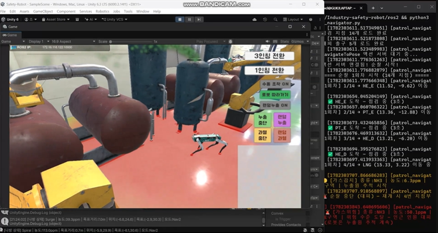
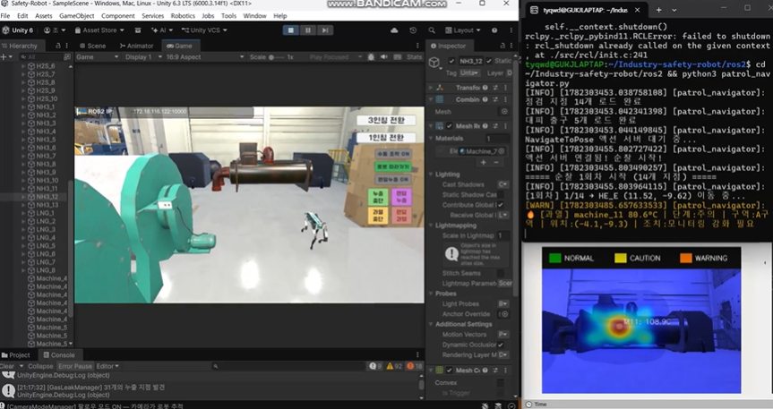
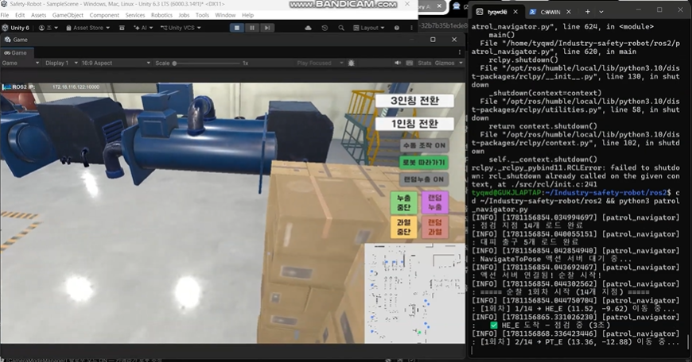
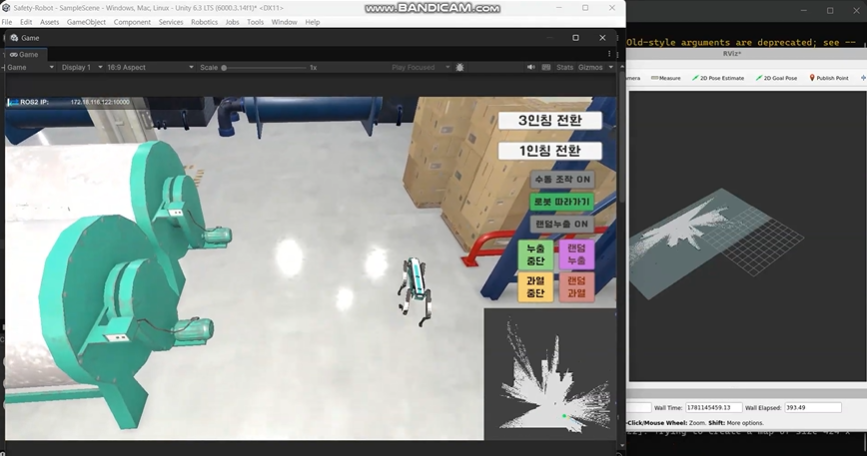

# Industry Safety Robot — 산업시설 자율점검 로봇 시뮬레이션

> 캡스톤디자인 13조 (A3C2 / IRIS) — Unity 기반 산업안전 보안관 로봇 시뮬레이션

4족 보행 로봇이 공장을 자율 순찰하며 **계기판 수치 인식 · 설비 과열 감지 · 가스 누출 탐지**를 수행하고,
관제 대시보드로 실시간 모니터링하며 이상 상황 발생 시 **LLM이 자연어 위험 리포트를 자동 생성**하는 시스템입니다.

---

## 데모 영상

각 썸네일을 클릭하면 해당 시연 영상(YouTube)으로 이동합니다.

| 가스 누출 탐지 | 설비 과열 감지 |
| :---: | :---: |
| [](https://youtu.be/0Ut86PaEgdE?si=RRvIf5f_OuGEGaeP) | [](https://www.youtube.com/watch?v=BeY0y42heQo) |
| **자율 순찰 시연** | **SLAM 맵 생성 시연** |
| [](https://youtu.be/rfLVErXSLjc?si=qPM98exPzOh7YswP) | [](https://www.youtube.com/watch?v=phk1RGzq0Oo) |

<!-- ↑ 각 https://youtu.be/영상ID-XXX 를 실제 유튜브 링크로 교체하세요. -->

---

## 시스템 구조

```
[Unity 시뮬레이션]          [ROS 2]              [관제 / 분석]
  HDRP 공장 씬        ─→   ROS-TCP-Connector  ─→  FastAPI 백엔드
  로봇 · 센서 · 가스모델      (WSL2, Ubuntu)         ├─ 위험도 분석 (risk_rules)
                                                  └─ LLM 리포트 (RAG)
                                                        │
                                                        ↓
                                                  React 대시보드
```

**데이터 흐름**

1. Unity가 로봇의 가스·온도 센서값을 ROS 토픽으로 발행
2. ROS 2 노드(`ros2/`)가 데이터를 중계 → 백엔드의 `POST /sensor`로 전달
3. 백엔드가 위험도(`risk_rules.py`)를 판정하고, 위험 등급 전환 또는 누출원 특정 시
   안전 문서(`data/`)를 참조하는 **RAG 기반 LLM 리포트**를 자동 생성
4. React 대시보드가 `GET /sensor`·`GET /report/latest`를 폴링해 실시간 표시

---

## 기술 스택

| 구분 | 기술 |
| --- | --- |
| 시뮬레이션 | Unity (HDRP), C# |
| Unity ↔ ROS 연동 | ROS-TCP-Connector |
| 로봇 미들웨어 | ROS 2 (Humble), WSL2 (Ubuntu) |
| 가스 확산 모델 | 가우시안 플룸 + 나방 탐색 알고리즘 |
| 백엔드 | Python, FastAPI, Uvicorn |
| 위험 분석 / 리포트 | 규칙 기반 위험도 판정 + LLM + RAG |
| 프론트엔드 | React, Vite |
| 인프라 | Docker |

---

## 레포지토리 구조

```
Industry-safety-robot/
├── Safety-Robot/          # Unity 시뮬레이션 프로젝트 (공장 씬, 로봇, 센서, 가스 모델)
├── ros2/                  # ROS 2 패키지 / 노드 (Unity ↔ 백엔드 중계)
├── llm-report/            # LLM 위험 분석·리포트 시스템
│   ├── backend/           # FastAPI 서버
│   │   ├── main.py        #   API 엔드포인트 (/sensor, /report, /report/latest)
│   │   ├── services/      #   risk_rules · report_generator · rag · llm · ros_adapter
│   │   └── data/          #   RAG 참조 안전 문서 (ammonia, h2s, lng, toxic_gas 등 PDF)
│   └── frontend/          # React 대시보드 (Vite)
│       ├── src/           #   App.jsx · main.jsx · index.css
│       └── package.json
├── dashboard/             # 대시보드 관련 리소스
├── docker/                # Docker 구성
├── LICENSE
└── README.md
```

### Unity 주요 스크립트 (`Safety-Robot/`)

| 스크립트 | 역할 |
| --- | --- |
| `ROSConnectionSetup.cs` | 씬 시작 시 ROS 연결 (WSL2 IP/Port 설정) |
| `CmdVelSubscriber.cs` | `/cmd_vel` 구독 → 로봇 이동 |
| `OdometryPublisher.cs` | 로봇 위치(odometry) 발행 |
| `LidarSensor.cs` | 2D LiDAR 시뮬레이션 (SLAM용) |
| `AutoNavigator.cs` / `FrontierExplorer.cs` | 자율 이동 · 맵 커버리지 탐색 |
| `GaussianPlumeModel.cs` | 가우시안 플룸 가스 확산 모델 |
| `GasLeakManager.cs` | 가스 누출 시나리오 관리 (랜덤/수동 트리거) |
| `VirtualGasSensor.cs` | 로봇 위치의 가스 농도 샘플링 → ROS 발행 |
| `GasHeatmap.cs` / `GasVisualizer.cs` | 가스 농도 시각화 |
| `MothSearchAlgorithm.cs` | 나방 탐색 알고리즘 (누출원 추적) |

---

## 공장 환경 (점검 대상 설비)

| 설비 | 수량 | 발생 가능 이벤트 |
| --- | --- | --- |
| PressureTank (압력 탱크, 1~6호기) | 6 | 과열 |
| HeatExchanger (열교환기) | 5 | 과열 |
| H2S 통 (황화수소) | 10 | 가스 누출 |
| NH3 통 (암모니아) | 13 | 가스 누출 |
| LNG 통 (액화천연가스) | 8 | 가스 누출 |

---

## 실행 방법

> **전제**: Windows + Unity 설치, WSL2(Ubuntu) + ROS 2 Humble, Python 3.10+, Node.js 18+
> 각 ROS 2 노드는 **별도 터미널**에서 실행하며, 모든 모듈은 아래 1번 TCP 노드가 떠 있어야 동작합니다.
> 명령어의 `ROS_IP` 값과 Unity의 연결 IP는 WSL2 IP(`wsl hostname -I`로 확인)로 맞춰야 합니다.

### 0. 클론

```bash
git clone https://github.com/<your-org>/Industry-safety-robot.git
cd Industry-safety-robot
```

### 1. 공통 — ROS-TCP-Connector (필수)

Unity와 ROS 2를 잇는 노드. 어떤 모듈을 켜든 항상 먼저 실행합니다.

```bash
ros2 run ros_tcp_endpoint default_server_endpoint --ros-args -p ROS_IP:=<WSL2_IP>
# 예) ROS_IP:=172.18.116.122
```

### 2. Unity 시뮬레이션

1. Unity Hub에서 `Safety-Robot/` 프로젝트 열기
2. 씬의 `ROSConnectionSetup` 오브젝트에 **WSL2 IP**(`wsl hostname -I` 값) 입력
3. **Play** → 공장·로봇·센서·가스 모델 작동 시작

### 3. 모듈별 ROS 2 노드 (WSL2)

#### (a) SLAM 맵 생성

```bash
# TF 노드
ros2 run tf2_ros static_transform_publisher 0 0 0 0 0 0 base_link base_scan

# SLAM Toolbox
ros2 launch slam_toolbox online_async_launch.py \
  slam_params_file:=$HOME/Industry-safety-robot/ros2/config/slam_params.yaml
```

#### (b) 순찰 모듈

```bash
# 1) Static TF (3줄 한 번에)
ros2 run tf2_ros static_transform_publisher --frame-id map --child-frame-id odom --x 0 --y 0 --z 0 --yaw 0 --pitch 0 --roll 0 &
ros2 run tf2_ros static_transform_publisher --frame-id base_link --child-frame-id base_scan --x 0 --y 0 --z 0 --yaw 0 --pitch 0 --roll 0 &
ros2 run tf2_ros static_transform_publisher --frame-id base_link --child-frame-id base_footprint --x 0 --y 0 --z 0 --yaw 0 --pitch 0 --roll 0

# 2) 맵 서버
cd ~/Industry-safety-robot/ros2
ros2 run nav2_map_server map_server --ros-args -p yaml_filename:=$(pwd)/maps/factory_map.yaml -p use_sim_time:=false &
sleep 3 && ros2 lifecycle set /map_server configure && ros2 lifecycle set /map_server activate

# 3) Nav2
cd ~/Industry-safety-robot/ros2
ros2 launch nav2_bringup navigation_launch.py use_sim_time:=false params_file:=$(pwd)/config/nav2_params.yaml

# 4) Scan Restamp (토픽 타임스탬프 호환용)
cd ~/Industry-safety-robot/ros2 && python3 scan_restamp.py

# 5) 순찰 노드
cd ~/Industry-safety-robot/ros2 && python3 patrol_navigator.py
```

실행하면 로봇이 미리 지정된 점검 지점들을 순서대로 순찰하며, 콘솔에 도착·점검 로그가 출력되고 순찰을 반복합니다.

#### (c) 과열 감지 모듈

```bash
# 열화상 가우시안 맵 생성 노드
cd ~/ros2_ws && source install/setup.bash
ros2 run thermal_fusion_pkg thermal_visualizer

# RGB + 열화상 알파 블렌딩 융합 노드 (별도 터미널)
cd ~/ros2_ws && source install/setup.bash
ros2 run thermal_fusion_pkg image_fusion

# (선택) 시각화 도구
rviz2
```

Unity의 HeatManager로 과열 시나리오를 발생시키면, 과열된 기계 감지 시 경고 토픽을, 정상 시 정상 토픽을 발행합니다.

#### (d) 가스 누출 모듈

순찰 모듈과 요구사항이 동일합니다. 가스 모듈만 따로 테스트하려면 **TCP 커넥터 + Nav2** 노드만 띄우면 됩니다.

### 4. LLM 리포트 대시보드

```bash
# 백엔드 (FastAPI)
cd llm-report/backend
pip install fastapi uvicorn openai python-dotenv pypdf   # 최초 1회
# .env 파일에 OPENAI_API_KEY=sk-... 가 있는지 확인
uvicorn main:app --host 0.0.0.0 --port 8000
```

```bash
# 프론트엔드 (Windows PowerShell)
cd llm-report/frontend
npm install        # 최초 1회
npm run dev        # 기본 http://localhost:5173
```

```bash
# LLM 브리지 노드 (ROS 2 → 백엔드 전달)
cd ~/<colcon_워크스페이스>
colcon build --packages-select llm_bridge_pkg
source install/setup.bash
ros2 run llm_bridge_pkg llm_bridge_node
```

> 대시보드는 평소처럼 **Nav2 + patrol_navigator**를 띄운 상태에서 위 백엔드·프론트·브리지 노드를 함께 실행합니다.

---

## 동작 시나리오

| 시나리오 | 내용 |
| --- | --- |
| 자율 순찰 | 저장된 14개 점검 지점(계기판·열교환기·가스 설비)을 순서대로 자율 이동·점검 |
| 가스 누출 (바람 없음) | 히트맵에서 로봇이 누출원으로 직선 접근 |
| 가스 누출 (바람 있음) | 나방 알고리즘이 캐스팅으로 공백을 뚫고 누출원 추적 |
| 설비 과열 | 온도 상승 → 위험 등급 전환 → LLM 경보 리포트 자동 생성 |

---

## UI 및 조작법

시뮬레이터 실행 화면은 **3D 메인 뷰**, **우측 조작 패널**, **우하단 미니맵(SLAM 지도 + 로봇 위치)**,
**좌측 상단 ROS2 IP 표시**로 구성됩니다.

### 화면 구성


좌측 상단에 **ROS2 연결 IP**, 우측에 **시점·시나리오 조작 패널**, 우하단에 **미니맵(SLAM 지도 + 로봇 위치)**,
가운데에 **메인 3D 뷰(공장 + 로봇)**가 표시됩니다.

### 조작 패널 버튼

| 버튼 | 기능 |
| --- | --- |
| **3인칭 전환** | 카메라를 3인칭 시점으로 |
| **1인칭 전환** | 카메라를 로봇 1인칭 시점으로 |
| **수동 조작 ON** | 자율 ↔ 수동 이동 전환 |
| **로봇 따라가기** | 카메라가 로봇을 자동 추적 |
| **랜덤누출 ON** | 일정 간격 자동 랜덤 가스 누출 모드 토글 |
| **랜덤 누출** | 가스 누출을 즉시 발생 (수동 트리거) |
| **누출 중단** | 진행 중인 가스 누출 중단 |
| **랜덤 과열** | 설비 과열을 즉시 발생 (수동 트리거) |
| **과열 중단** | 진행 중인 과열 중단 |

### 키보드 단축키

| 키 | 기능 |
| --- | --- |
| `Tab` | 자동/수동 모드 전환 · 조작 UI 표시/숨김 |

> 점검 지점은 `HE`(열교환기), `PT`(압력계), `LNG` · `NH3`(가스 설비) 등으로 명명되며,
> 콘솔(`patrol_navigator`)에 각 지점 도착·점검 로그가 실시간 출력됩니다.

---

## 팀

캡스톤디자인 13조 (A3C2 / IRIS)

---

<!--
※ 커밋 전 팀원 확인 사항
  1. clone URL의 <your-org> 부분
  2. colcon 워크스페이스 경로 통일 (가이드에 ~/ros2_ws 와 ~/Industry-safety-robot/ros2 혼용됨)
  3. dashboard/ 폴더 용도 (llm-report/frontend와 별개인지)
  4. assets/ 폴더에 스크린샷 4개 추가: demo_gas.png · demo_thermal.png · demo_patrol.png · demo_slam.png
-->
